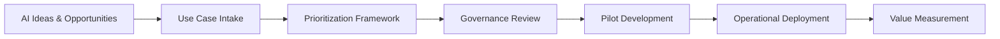

# ai-transformation-playbook
A practical framework for turning AI strategy into structured execution through governance, prioritization, and operational delivery models.

## AI Transformation Workflow

This playbook provides structure for organizations implementing AI initiatives.

Rather than treating AI as isolated experiments, the framework introduces an operating model that ensures ideas are evaluated, prioritized, governed, delivered, and measured in a consistent and accountable way.

## Who This Playbook Is For

This framework is designed for:

• Organizations beginning AI transformation  
• Program managers responsible for AI initiatives  
• Operations leaders coordinating cross-team delivery  
• Executives seeking governance and accountability in AI investments  

## Author

Somer Walker  
Enterprise Program Leader | Operational Excellence | AI Transformation

Background leading complex cloud, infrastructure, and AI initiatives across global organizations. Focused on turning strategy into disciplined execution.

LinkedIn: (add link later)
