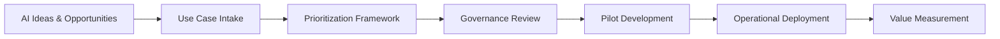

# ai-transformation-playbook
A practical framework for turning AI strategy into structured execution through governance, prioritization, and operational delivery models.

## AI Transformation Workflow

This playbook provides structure for organizations implementing AI initiatives.

Rather than treating AI as isolated experiments, the framework introduces an operating model that ensures ideas are evaluated, prioritized, governed, delivered, and measured in a consistent and accountable way.

## Who This Playbook Is For

This framework is designed for:

• Organizations beginning AI transformation  
• Program managers responsible for AI initiatives  
• Operations leaders coordinating cross-team delivery  
• Executives seeking governance and accountability in AI investments  

## Repository Contents

This repository contains practical frameworks and templates for organizations implementing AI initiatives with structure and accountability.

### 📘 Documentation

| File | Description |
|-----|-------------|
| `docs/01-executive-overview.md` | Overview of the AI transformation challenge and the operating model introduced in this playbook |
| `docs/02-ai-use-case-intake.md` | Framework for capturing and evaluating AI opportunities in a structured way |
| `docs/03-prioritization-framework.md` | Scoring and prioritization model for selecting AI initiatives based on value and readiness |
| `docs/04-governance-model.md` | Governance structure defining roles, decision rights, and executive oversight |
| `docs/05-risk-and-readiness.md` | Risk identification and readiness assessment for AI initiatives |
| `docs/06-delivery-operating-model.md` | Operational model for moving AI projects from pilot to production |
| `docs/07-metrics-and-value-realization.md` | Measuring outcomes, adoption, and business value of AI implementations |
| `docs/08-example-90-day-plan.md` | Example roadmap for launching an AI transformation initiative |

### 🧰 Templates

| File | Description |
|-----|-------------|
| `templates/ai-use-case-intake-template.md` | Structured template for documenting potential AI initiatives |
| `templates/ai-risk-register-template.md` | Template for identifying and tracking risks during AI implementation |
| `templates/stakeholder-map-template.md` | Tool for mapping stakeholders and decision authority |
| `templates/decision-log-template.md` | Governance log to document key program decisions |
| `templates/executive-status-update-template.md` | Executive reporting template for AI transformation programs |

### 📊 Examples

| File | Description |
|-----|-------------|
| `examples/example-use-case-assessment.md` | Example evaluation of an AI use case |
| `examples/example-prioritization-matrix.md` | Example scoring model for selecting AI initiatives |
| `examples/example-steering-committee-agenda.md` | Example governance meeting structure for AI program oversight |

---

This repository is intended to be a practical starting point for organizations seeking to operationalize AI initiatives through disciplined governance, prioritization, and delivery practices.

## Author

Somer Walker  
Enterprise Program Leader | Operational Excellence | AI Transformation

Background leading complex cloud, infrastructure, and AI initiatives across global organizations. Focused on turning strategy into disciplined execution.

LinkedIn: https://www.linkedin.com/in/somerwalker
